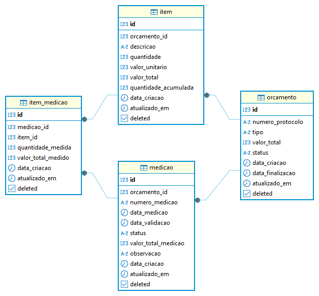

# Sistema de Controle de Orçamentos e Medições

Este projeto é um ecossistema backend desenvolvido em Spring Boot para o gerenciamento do ciclo de vida de obras, desde o orçamento inicial até a medição física e financeira dos serviços.

---

## 🚀 O que foi implementado?
Diferente de um CRUD básico, este sistema conta com:

Segurança: Autenticação e autorização via JWT (JSON Web Token).

Relatórios Dinâmicos: Endpoints de Dashboard para Evolução Financeira Mensal e Resumo de Obras (Orçado vs. Medido).

Documentação: Interface interativa via Swagger/OpenAPI.

Resiliência: Validações rigorosas de saldo de itens para evitar medições a maior.

Soft Delete: Exclusão lógica utilizando a nova anotação @SoftDelete do Hibernate 7.

## Tecnologias Utilizadas

- **Java 21**
- **Spring Boot 4.0.x**
- **Spring Data JPA**
- **Hibernate 7**
- **PostgreSQL**
- **Docker & Docker Compose**
- **Lombok**
- **Maven**

---

## Modelo de Dados (ER)

A modelagem foi estruturada para garantir a integridade dos dados financeiros, utilizando precisão de 4 casas decimais para quantidades e restrições de integridade (Foreign Keys e Unique Constraints) para protocolos e números de medição.



---

## Como Executar 

### 1. Requisitos
- Docker e Docker Compose instalados.
- JDK 21 instalado (opcional, se rodar via Docker).

### 2. Docker
O projeto está  containerizado.
Para subir o banco de dados e a aplicação:

Subir tudo:

```bash
docker-compose up -d
```
Isso iniciará o banco PostgreSQL e a API. O banco será populado automaticamente se houver scripts em ./init-db.
 
Para parar os containers do banco:
 ```bash
> docker-compose down
> ```
Acessar a Documentação:
Com a aplicação rodando, acesse o Swagger para testar os endpoints:
```bash
http://localhost:8080/swagger-ui/index.html
```

### 📊 Dashboard e Relatórios (Novidade)
Foram implementados endpoints analíticos para visão gestora:

Dados para gráficos de linha (mês a mês):
```bash
GET /api/v1/dashboard/evolucao-financeira  
````

Tabela de progresso percentual e saldo a receber por contrato:
```bash
GET /api/v1/dashboard/resumo-obras 
```  

### ⚖️ Regras de Negócio de Destaque
Trava de Orçamento: Uma vez FINALIZADO, o orçamento não permite alteração de valores, tornando-se um documento oficial para medição.

Integridade de Medição: O sistema impede que a soma das quantidades medidas ultrapasse a quantidade orçada, garantindo o controle do saldo contratual.

Segurança de Deleção: Utilização de Soft Delete para manter o histórico de auditoria mesmo após "exclusões".
Execute a aplicação utilizando o Maven Wrapper:

### Futuras Melhorias

```bash
Integração com serviço de armazenamento S3 para fotos das medições.
```

---

## Endpoints / Funcionalidades Principais (exemplos)

- **Orçamentos**
    - `POST /orcamentos` → Criar novo orçamento
    - `PUT /orcamentos/{id}` → Atualizar orçamento existente
    - `GET /orcamentos` → Listar orçamentos
    - `GET /orcamentos/{id}` → Detalhes de um orçamento

- **Itens do Orçamento**
    - `POST /orcamentos/{id}/itens` → Adicionar item ao orçamento
    - `PUT /orcamentos/{id}/itens/{itemId}` → Atualizar item

- **Medições**
    - `POST /medicoes` → Criar nova medição
    - `PUT /medicoes/{id}/validar` → Validar medição
    - `GET /medicoes` → Listar medições

- **Itens da Medição**
    - `POST /medicoes/{id}/itens` → Adicionar item à medição
    - `PUT /medicoes/{id}/itens/{itemId}` → Atualizar item medido (apenas se medição estiver aberta)

---

## Regras de Negócio Implementadas

- **Orçamentos**
    - Cadastro de protocolos únicos com tipos específicos de obra
    - Controle de status: `Aberto` ou `Finalizado`
    - Valor total = soma dos valores dos itens

- **Itens**
    - Gerenciamento de quantidades com precisão decimal
    - Valor total calculado automaticamente (Quantidade × Valor Unitário)
    - Quantidade acumulada atualizada conforme medições
    - Bloqueio de edição para itens de orçamentos finalizados

- **Medições**
    - Apenas uma medição aberta por orçamento
    - Validação atualiza a quantidade acumulada dos itens
    - Quantidade medida não pode ultrapassar a quantidade total do item
---

## Possíveis Melhorias

- Adição de autenticação JWT
- Documentação via OpenAPI/Swagger
- Testes unitários e de integração
- Relatórios financeiros via JasperReports
- Deploy em nuvem ou containerização completa do backend

---

## Contato

Feito por **Rafael Otavio Campos**  
LinkedIn: https://www.linkedin.com/in/rafaelotaviocampos  
GitHub: https://github.com/rafaelotaviocampos  
Email: only_roc@hotmail.com
